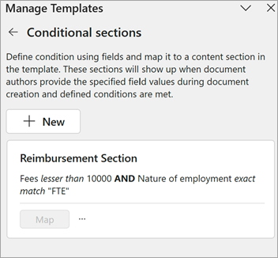
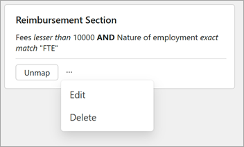

# Add a conditional section to a template in SharePoint Agreements

## Add a conditional section to a template

Conditional sections in a template let you create documents that change based on the information given by the document authors.

Before you can create a conditional section, you first need to add fields to the template on which the condition is based. Then, follow these steps to create a conditional section.

1. In the document, open the **Manage templates** panel and select **Define conditional sections**.

   

2. On the **Manage templates** panel, under **Conditional sections**, select **+ New** to start adding the condition.

   

3. Under **New conditional section**, in the **Name** box, enter a name that reflects the content you've selected. (For this example, we named it *Reimbursement Section*.)

   

### Set conditions

You can add conditions to specify whether this section of the template will be included in the final generated document based on the values of the fields entered by the author.

For this example, we want to show the selected content for two conditions: if the fees are less 10,000 and if the nature of employment is full time.

#### Add the first condition

On the **Manage templates** panel, in the **Set up condition** section:

1. Select **Choose a field**, and then select the appropriate field. (For this example, we selected *Fees*.)

2. Select **Choose a condition**, and then select the appropriate condition. (For this example, we selected *lesser than*.)

3. Select **Enter a value**, and then enter the appropriate value. (For this example, we entered *10000*.)

   

#### Add additional conditions

In the **Set up condition** section:

1. Under the first condition, select **+ And** or **+ Or**, depending how you want the additional condition to be linked to the first condition. (For this example, we chose *And*.)

2. Select **Choose a field**, and then select the appropriate field. (For this example, we selected *Nature of employment*.)

3. Select **Choose a condition**, and then select the appropriate condition. (For this example, we selected *exact match*.)

4. Select **Enter a value**, and then enter the appropriate value. (For this example, we entered *FTE*.)

   

5. When you're done entering conditions, select **Save**. You can see the new condition under **Conditional sections**.

   

#### Map the condition to a document section

After creating the condition, you need to map it to the section of the document that you want to display based on this condition. To do this, select the relevant section in the document and then select **Map**.

If you want to change the section of the document mapped to this condition, select **Unmap** and then repeat the process of mapping a section to the condition.

#### Edit a conditional section

To edit the conditions in a conditional section, select **More options** (**...**), and then select **Edit**.

   

#### Delete a conditional section

To delete the conditions in a conditional section, select **More options** (**...**), and then select **Delete**. This deletes the condition and unmaps the selected section.

> [!NOTE]
> - You can create conditional sections around text, complete paragraphs, and entire tables. To create conditional sections around images, ensure the images are inline images.
>- You can't add conditions around table rows and columns.
>- You can't map multiple sections in the document to one condition. One condition can only be mapped to one section in the document.
>- You can't add nested conditions. To achieve nested conditions, you need to create conditional sections around every section and specify all the required conditions.

