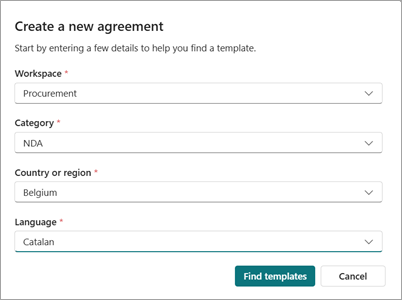
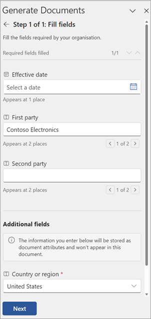
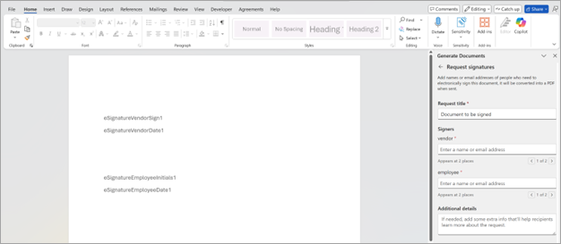
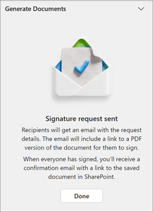
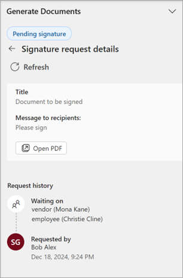
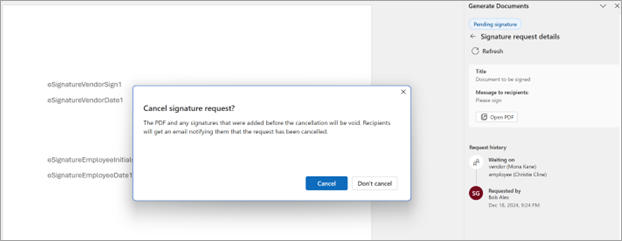

# Create an agreement in SharePoint Agreements

## Create an agreement from a published template

To create an agreement from a published template, follow these steps:

1. From the Agreements app in Microsoft Teams, start an agreement by using either of these two methods.

   - On the **Home** tab, select the **Create an agreement** card.

   - On the **Agreements** tab, select the **New agreement** button.

2. On the **Create a new agreement** page, provide the required details, and then select **Find templates**.

   

3. You see a list of published templates that match the information you provided. If more than one template matches the information you provided, you can preview the templates and select the template you'd like to use.

4. On the **Details** panel, provide a file name for the agreement.

5. Select **Edit** to generate the new agreement. The agreement opens in Microsoft Word from where you can provide values for fields and send the document for workflow.

## Create an agreement from a template in Word

To create an agreement from Microsoft Word, follow these steps:

1. Open Microsoft Word, and then open a new blank document.

2. On the **Agreements** tab, select **Generate documents**.

3. Select **Select a template**.

4. Choose the workspace to see the available templates in the workspace.

5. Pick the template you want to generate agreements from, and then select **Use template**.

6. The template opens in a new window where you can provide values for fields and send the document for workflow.

### Fill in field values while generating an agreement

1. In Microsoft Word, on the **Generate documents** panel, select **Fill fields** to display list of fields set up in the template.

   

2. Enter the values for all fields marked as mandatory. You can also provide values for fields not marked as mandatory.

   > [!NOTE]
   > Some fields might be present in the document content, while some might not be present. These are configured in the template.

3. Select **Next** to review and confirm that the correct information has been entered for all the fields.

4. If there are no errors, a summary of all required fields with their values is displayed.

5. You can also modify section content if there are sections in the template marked as editable.

6. Once you're done making all changes, select **Next** to set the document to read-only mode to prevent any further edits.

## Send the agreement for workflow

Template creators have the option to configure two workflows: [request approvals](#request-approvals) and [request signatures](#request-signatures). Any agreement generated from such a template needs to go through the workflow stages configured at the template level.

> [!NOTE]
> If the workflow is not configured with the template, you can still request approvals for documents generated from templates.

### Request approvals

After you fill in the fields, the next step is to send the document for approval.

1. With the agreement open in Microsoft Word, on the **Generate documents** panel, select **Request approvals**.

2. You can change the name of the request, add other approvers as needed, and provide more details about the agreement.

3. Select **Send** to send the document for approval.

The document is set to read-only, and the document is shared with the approver.

For documents where mandatory approvals aren't configured, you can still choose to add approvers as needed.

1. With the agreement open in Microsoft Word, on the **Generate documents** panel, select **Request approvals**.

2. You can provide the name of the request, add approvers as needed, and provide more details about the agreement.

3. Select **Send** to send the document for approval.

The document is set as read-only, and the document will be shared with the approver.

### Request signatures

After making the necessary changes to the document, filling in the required field values, running the revision analysis to review all section modifications, and obtaining approval according to the workflow set at the template level, you can then send the generated agreement for electronic signatures.

SharePoint Agreements uses SharePoint eSignature to set up and send signature requests to recipients. For more information, see [Overview of SharePoint eSignature](/microsoft-365/syntex/esignature-overview).

> [!NOTE]
> The document can only be sent for eSignature if at least one signature field is configured at the template level.

To request eSignature for a document, follow these steps:

1. With the agreement open in Microsoft Word, on the **Generate documents** panel, select **Request signatures**.

2. The document is now in viewing mode to prevent further edits. If the document is already approved, it can be directly sent for eSignature since the content is already locked for editing.

    > [!NOTE]
    > If you select **Edit document** from the pane at any time during or after the eSignature process, the document's state will be reset to **Draft**, and any pending signature requests will be canceled. You will need to request eSignature again with the modified document after making the relevant changes. This ensures that the document's integrity is maintained both during and after the eSignature process.

3. Enter the name for the signature request, and then enter the requested signers' names or email addresses (whether internal or external to the organization). Optionally, you can add more information about the request for the signers.

    

4. After all the details are entered, select **Send**. The PDF version of the Word document is created and is sent for signature to the names and email addresses you entered.

    

5. Once the signature request is sent, you can track its status (**Signature in progress**, **Signature completed**) through the Word pane by reloading the document management pane or by  selecting **Refresh**.

    

6. You can view the signature in progress and view the final signed PDF document in SharePoint by selecting **Open PDF**.

7. If you want to cancel the sent signature request, select **Cancel request** or select the **Edit** section. This will cancel all running flows, unlock the section for further edits, and return the document to the **Draft** state.

    

 

> [!div class="nextstepaction"]
> [See the complete list of help documentation.](agreements-overview.md#help-documentation)
