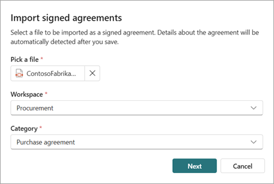
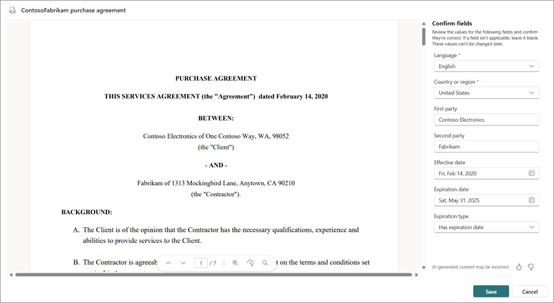
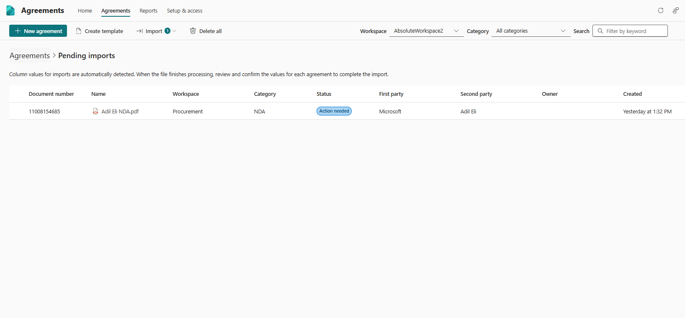

# Import signed agreements in SharePoint Agreements

You can add existing agreements by uploading signed documents. Select a file or mulitple files to be imported as signed agreements. Details about the agreements will be automatically detected after you save.

> [!NOTE]
> To import scanned PDF files and extract data from them, you need to enable the [OCR pay-as-you-go service](/microsoft-365/syntex/ocr-overview).

To import agreements, follow these steps:

1. From the Agreements app in Microsoft Teams, start an import by using either of these two methods.

    - On the **Home** tab, select the **Import a agreements** card.

    - On the **Agreements** tab, select the **Import** button and select **Import signed agreements**.

2. On the **Import signed agreements** dialog, browse to and pick the file or files that you want to import. The files must be a PDF.

   

3. Choose the workspace where the agreements should be stored, and then pick the category to which the agreements belongs.

4. Select **Next** to process the files and detect fields.

> [!NOTE]
> You can either import a single signed agreements, or import multiple agreements in bulk. Depending on the number of files you imported, the experience to review the detected changes differ. 

## Review detected details for a single imported agreement
1. Once processing is complete, review the extracted values and confirm if they're correct. If a field isn't applicable, leave it blank.

   

   > [!NOTE]
   > The values in the fields can't be changed later.

2. Select **Save** to confirm the import. The imported agreement will be visible in the list of agreements.

   > [!NOTE]
   > It might take a few hours for the new agreement to be indexed and show up in the list of agreements.

 

## Review detected details for a multiple imported agreement
If you imported mulitple agreements, details about the agreements will be detected in the background. This process may take time, and you can come back to review the detected details. 

1. To see the list of agreements pending your confirmation, go to the **Agreements** tab, select the **Import** button and select **Review pending imports**.

3. The **Pending imports** page will open and show you the list of all imported agreements that are pending your review.

4. There are three possible states for each pending import:
---
|Status  |Description  |
|---------|---------|
|Processing    |The file is still being processed. Check back later.         |
|Action needed    |Details have been detected, and user action is needed for a few mandatory fields.         |
|Ready to confirm    |All details have been detected, the file is ready to be reviewed & confirmed.         |
---   
4. For files that are ready to confirm, you can either preview the file by clicking on the file, or select the file and confirm the values with the Confirm button on the action bar. You can confirm multiple files in the ready to confirm status at once.

5. For files that are in *Action needed* status, click on the file to preview the file and provide values for mandatory fields. Once all mandatory fields have been set, you can confirm the file.
   > [!NOTE]
   > The values in the fields can't be changed later.

6. You can also delete files from the pending imports page. Deleting a file will remove it from the workspace.
   > [!NOTE]
   > It might take a few hours for the new agreement to be indexed and show up in the list of agreements.

 

> [!div class="nextstepaction"]
> [See the complete list of help documentation.](agreements-overview.md#help-documentation)
