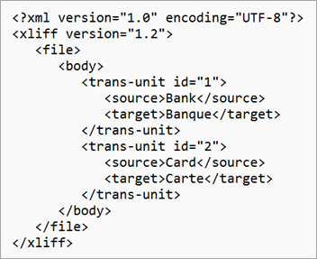
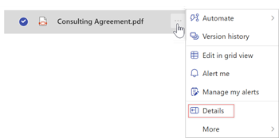

# Create and use a custom glossary for document translation in Microsoft Syntex

You can use a custom glossary file to ensure that the specific terminology is consistently and accurately translated. The glossary file contains a list of terms in the source language along with their corresponding translations in the target language.

For example, if your organization has a trademarked name that you don't want translated, you can add that to the glossary file. You can also specify the capitalization to use for words, choose specific translations for ambiguous words, or designate specific meanings for your unique context.

## Create a glossary file

Supported file formats for a glossary file include a simple [CSV, TSV, or TAB file](#create-a-csv-tsv-or-tab-glossary-file) or a more complicated [XLF file](#create-an-xlf-glossary-file). You need to create a separate glossary file for each language. The terms and phrases in the glossary file are case-sensitive.

### Create a CSV, TSV, or TAB glossary file

Follow these steps to create a glossary file as a CSV, TSV, or TAB file.

1. Open a text editor or a spreadsheet application, such as Notepad or Microsoft Excel.

2. Add the terms and phrases you want to use in your translation.

    - In the first column of the worksheet, add the terms or phrases in the source language.
    - In the second column, add the terms or phrases in the target language.

    ```tsv
       Bank     Banque
       Card     Carte
       Crane    Grue
       Office   Office
       Tiger    Tiger
       US       United States
    ```

3. Save the file as a TSV file (\*.tsv) or a TAB file (\*.tab). If the content is comma (,) separated, save it as a CSV file (\*.csv).

4. Upload the file to the appropriate SharePoint document library or OneDrive folder.

### Create an XLF glossary file

XLF files are used to store and exchange translation data between different localization tools and systems. Follow these steps to create a glossary file as an XLF file.

1. Open a text editor, such as Notepad. You can also use Visual Studio Code or an integrated development environment (IDE) like Visual Studio.

2. Define the structure and content of the terms and phrases you want to store in a hierarchical format.

    - Inside the **\<source>\</source>** tag, add the term or phrase in the source language.
    - Inside the **\<target>\</target>** tag, add the corresponding term or phrase in the target language.
    - If you have more pairs of translation, you can add new **\<trans-unit>\</trans-unit>** tags.

    ~~~
    <?xml version="1.0" encoding="UTF-8"?>
    <xliff version="1.2">
       <file>
          <body>
             <trans-unit id="1">
                <source>Bank</source>
                <target>Banque</target>
             </trans-unit>
             <trans-unit id="2">
                <source>Card</source>
                <target>Carte</target>
             </trans-unit>
          </body>
       </file>
    </xliff>
    ~~~


<!---

    
--->

3. Save the file as an XLF file (*.xlf).

4. Upload the file to the appropriate SharePoint document library or OneDrive folder.

## Use a glossary file

When you create a translated copy of a document, you can specify the glossary file to use. On the **Translate documents** screen, under **Translation glossary**, you can either select a glossary file from the current document library or [paste a link to a glossary file](#link-to-a-glossary-file) from another document library on the same site. For step-by-step instructions, see [Translate a document](translation.md).

## Update a glossary file

Follow these steps to update a glossary file.

1. Download the file from the SharePoint library to your computer.

2. Make the necessary changes to the file.

3. Save the updated file on your computer.

4. Upload the updated file back to the SharePoint library.

## Share a glossary file

You can use the same glossary file across multiple document libraries within the same SharePoint site [by copying its link path](#link-to-a-glossary-file). However, if you want to use a glossary file from a different SharePoint site, you must first download the file from one site and upload it to another site.

## Link to a glossary file

If the glossary file you want to use is in the same SharePoint library as the document you want to translate, you can select it from the drop-down list. If the glossary file is in a different library, you need to add a link to the file.

Follow these steps to add a link to a glossary file.

1. Select the glossary file you want to use.

2. Next to the file name in the list of documents, select **More actions** (**...**), and then select **Details**.

    

3. On the **Details** panel, go to **Path**, and select the **Copy direct link** icon ().

4. Go back to the **Translate documents** screen, select the language, and under **Translation glossary**, paste the link.
