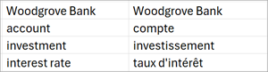

# Create and use a custom glossary for document translation in Microsoft Syntex

You can use a custom glossary file to ensure that the specific terminology is consistently and accurately translated. The glossary file contains a list of terms in the source language along with their corresponding translations in the target language.

For example, if your organization has a trademarked name that you don't want translated, you can add that to the glossary file. You can also specify the capitalization to use for words, choose specific translations for ambiguous words, or designate specific meanings for your unique context.

You can use the same glossary file across multiple document libraries within the same SharePoint site [by copying its link path](#link-to-a-glossary-file). However, if you want to use a glossary file from a different SharePoint site, you must first download the file from one site and upload it to another site.

## Create a glossary file

The glossary file should include all the terms and phrases you want to use in your translation. You need to create a separate glossary file for each language.

The most common file formats are a simple CSV file or a more complicated XLF file. For other supported file formats, see [Get supported glossary formats](/azure/ai-services/translator/document-translation/reference/get-supported-glossary-formats).

### Create a CSV glossary file

Follow these steps to create a glossary file as a CVS file.

1. Open a new workbook in Microsoft Excel.
<!---
2. Add a column heading for each piece of information you want to record (for example, first name, last name, email address, phone number, and birthday), and then type the information in the appropriate columns.

 Create a CSV file (or [other supported file format](/azure/ai-services/translator/document-translation/reference/get-supported-glossary-formats)) that contains all the terms and phrases you want to use in your translation.
--->
2. In the first column of the worksheet, add the terms or phrases in the source language. In the second column, add the terms or phrases in the target language. The terms and phrases in the glossary are case-senstive.

    

3. Save the file as a CSV (*.csv) file.

4. Upload the file to the appropriate SharePoint document library or OneDrive folder.

### Create an XLF glossary file

XLF files are used to store and exchange translation data between different localization tools and systems. Follow these steps to create a glossary file as an XLF file.

1. Open a text editor, such as Notepad, Visual Studio Code, or an integrated development environment (IDE) like Visual Studio.

2. Define the structure and content of the data you want to store in a hierarchical format.

    

## Update a glossary file

Follow these steps to update a glossary file.

1. Download the file from the SharePoint library to your computer.

2. Make the necessary changes to the file.

3. Save the updated CSV file on your computer.

4. Upload the updated file back to the SharePoint library.

## Link to a glossary file

If the glossary file you want to use is in the same SharePoint library as the document you want to translate, you can select it from the drop-down list. If the glossary file is in a different library, you need to add a link to the file.

Follow these steps to add a link to a glossary file.

1. Select the glossary file you want to use.

2. Next to the file name in the list of documents, select **More actions** (**...**), and then select **Details**.

    

3. On the **Details** panel, go to **Path**, and select the **Copy direct link** icon ().

4. Go back to the **Translate documents** screen, select the language, and under **Translation glossary**, paste the link.
